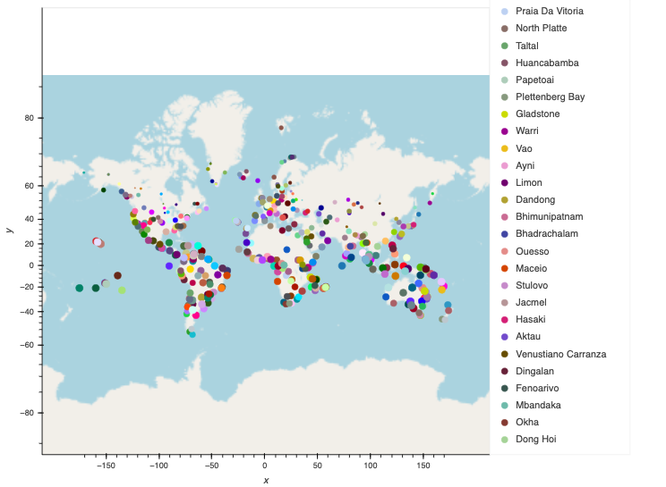
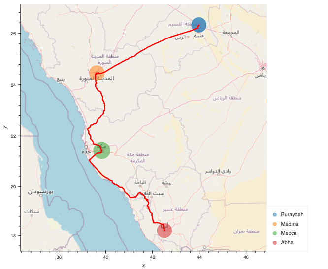

# World Weather Analysis
----
## Purpose
The goal of this analysis is to create a vacation map that allows users to apply weather criteria to identify potential travel destinations. [geoapify](https://www.geoapify.com/) also provides recommendations for ideal hotels in your preferred travel destinations.
___

## Overview
By generating a list of 2,000 random latitude and longitude coordinates to create a vacation map. Using the coordinates, I used the Citipy module to get the list of the closest cities and compiled it. Then [OpenWeatherMap](https://openweathermap.org/) API to request current weather data from each city in the list. The resulting map provides the user with a description of the listed destinations, including hotel name, city, country, and current weather.

---
## Result

- We used GeoViews to create a map that displays a point for every city in the `clean_hotel_df`  DataFrame.

- We used the GeoViews `Path` function to configure a line plot by using `route_df`. Set a custom color and width for the line that may contrast with the map

